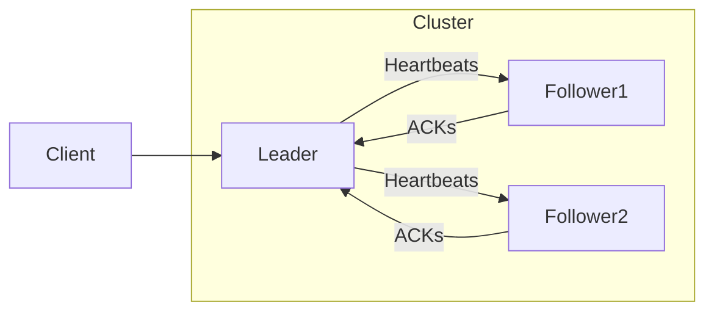

# Distributed Consensus System (Raft Implementation)

A C# implementation of the Raft consensus algorithm that simulates how distributed systems maintain consistency despite network partitions and node failures.

## Table of Contents
- [Key Features](#key-features)
- [Architecture](#architecture)
- [Getting Started](#getting-started)
- [Core Components](#core-components)
- [Consensus Protocol](#consensus-protocol)
- [Failure Handling](#failure-handling)
- [Interactive Testing](#interactive-testing)
- [Monitoring](#monitoring)
- [Limitations](#limitations)
- [Contributing](#contributing)
- [License](#license)

## Key Features

- 🏗️ **Complete Raft protocol** implementation (leader election, log replication, safety)
- 🧩 **Network partition simulation** (configurable split groups)
- 💥 **Node failure/recovery handling** (fail-stop model)
- 📊 **Interactive testing console** (real-time control)
- 📝 **Detailed logging system** (message traces + state transitions)
- ⏱️ **Configurable timers** (election timeouts, heartbeat intervals)

## Architecture

# GETTING STARTED
---------------
Prerequisites:
- Used .NET 8.0 SDK - Should be able to run in earlier versions
- IDE (Visual Studio/Rider/VSCode) - I Used Visual Studio

Installation:
1. Clone the repository:
2. Navigate to project:
3. Build the solution:
   dotnet build

CORE COMPONENTS
---------------
Node.cs:
- Implements Raft state machine (Leader/Follower/Candidate)

Network.cs:  
- Simulates message passing with configurable reliability

DistributedSystem.cs:
- Manages node lifecycle and cluster operations

CONSENSUS PROTOCOL
------------------
Leader Election:
1. Followers wait for leader heartbeat (random timeout 150-300ms)
2. If timeout expires, follower becomes candidate  
3. Candidate requests votes from all nodes
4. First candidate to get majority votes becomes leader

Log Replication:
1. Client sends command to leader
2. Leader appends command to local log
3. Leader replicates command to followers  
4. When majority acknowledge, entry is committed

FAILURE HANDLING
----------------
Network Partitions:
To create a partition:
system.CreatePartition(["node1","node2"], ["node3","node4"])

To heal partition:  
system.HealPartition()

Node Failures:
To fail a node:
system.FailNode("node2")

To recover node:
system.RecoverNode("node2")  

INTERACTIVE TESTING
-------------------
Run the Project and this menu should pop up

Distributed Consensus System Tester
==================================
1. Show system status
2. Propose new value  
3. Fail random node
4. Recover node
5. Create network partition
6. Heal network partition
7. Show logs
9. Restart Elections
0. Exit

MONITORING
----------
Access logs wiht option #7
You can select either Message Logs or State Transition Logs.
And it returns dictionary containing:
- Message history  
- State transitions
- Current node status

LIMITATIONS
-----------
- Simulation only (no real network)
- In-memory storage
- Fixed cluster size
